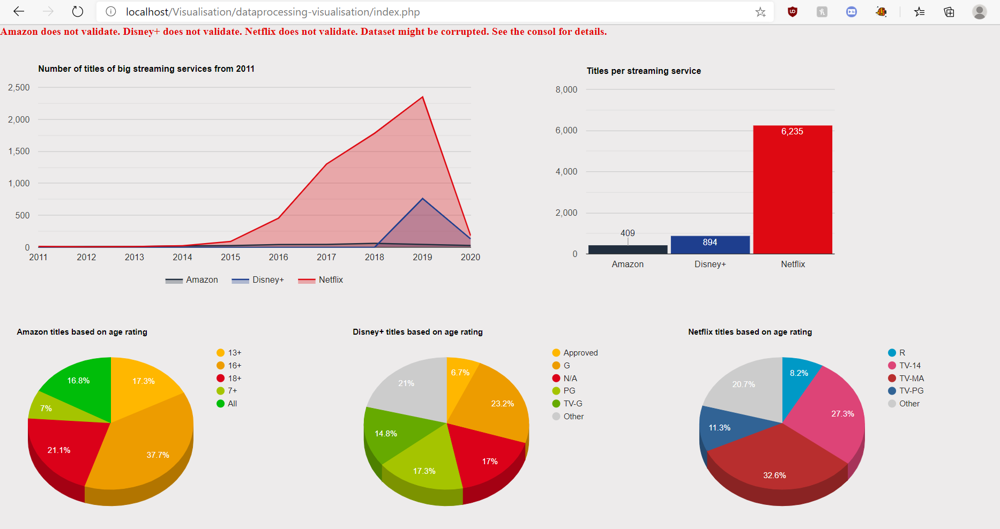

#Visualisation for class - Dataprocessing 
## Made by Chris Takacs (4644530)

####This visualisation requires a few elements before being able to run correctly:
1. The user needs to host the application on a local server (preferably xampp)
2. The user needs to host the api provided correctly

If all elements were done correctly (including setting up the api) the result should be as follows:

